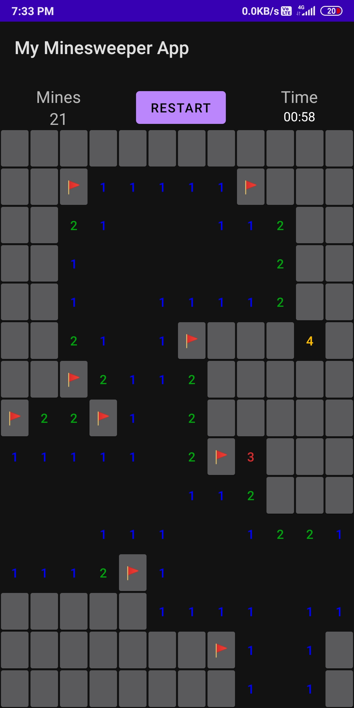

# Minesweeper-App

# Game rules

-> Every button on the minesweeper board can either be unturned, or marked as a flag.

-> Every unturned button on the board holds a number, which represents the number of neighbouring mines.

-> If the number of neighbouring mines for the unturned button is zero, all its neighbours are unturned as well.

-> If you unturn a mine, you lose.

-> If you marks all of the mines as flags or you unturn all safe fields, you win.

# Controls

-> Tap a field to reveal it.

-> Long press on a field to flag it.

-> Long press on a flagged field to unflag it (Flagged fields cannot be revealed by accident until they are un-flagged).

# Features Implemented

-> Player can select the difficulty level or make a custom board.

	Following are the constraints for the custom board:

	i) Number of rows should be less than 23.

	ii) Number of columns should be less than 19.

	iii) Number of mines should be always less than 1/4th of the board’s buttons.

-> Best win time and last game time are displayed on the home screen.

-> A top bezel in the game screen that displays information about the game (number of mines left to be flagged and timer) as well as provides a button to restart the game.

-> The mines are generated randomly after the first click to ensure that the user’s first click doesn’t detonate a mine.

# To run the app

-> Run through android studio by importing the project.

OR

-> Download the zip file - Copy the Minesweeper.apk file to your android device. Install, run and enjoy.

# Screenshots

